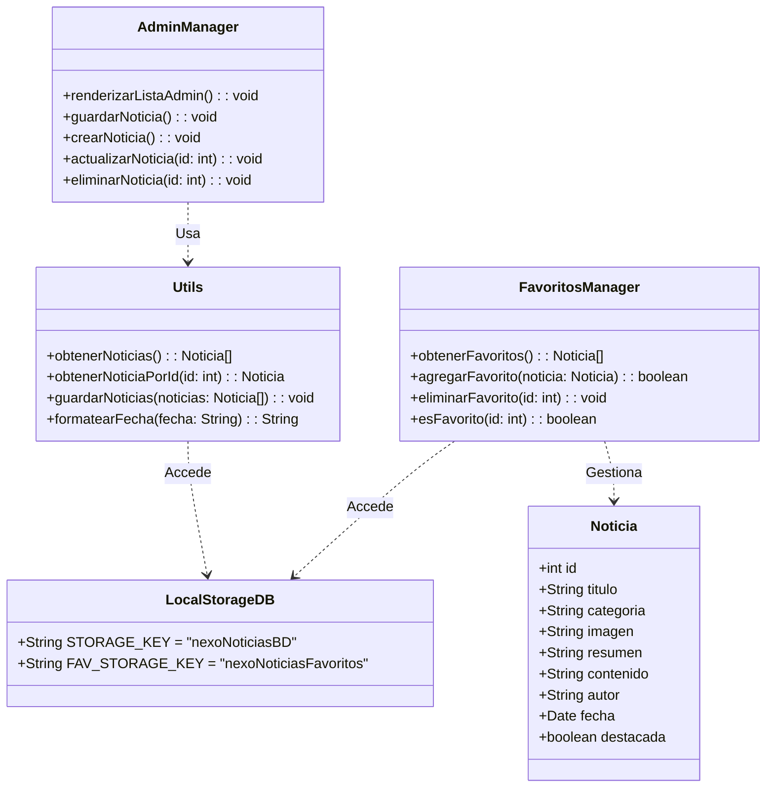
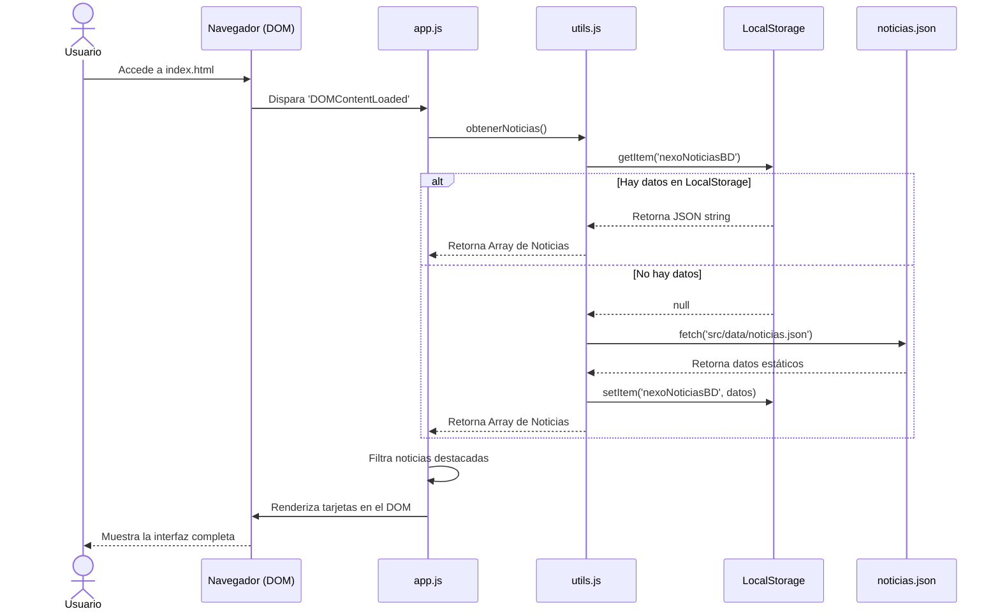

# Documentación Integral del Proyecto: Nexo Noticias

Este documento consolida y expande exhaustivamente toda la información técnica, funcional, y estructural del sistema **Nexo Noticias**. Incluye los diagramas UML que representan la arquitectura y el comportamiento de la plataforma web.

---

## 1. Diagramas UML (Lenguaje de Modelado Unificado)

A continuación se presentan los diagramas estructurales y de comportamiento del sistema.

### 1.1 Diagrama de Casos de Uso
Modela las interacciones principales entre los actores (Visitante, Administrador) y el sistema.

```mermaid
usecaseDiagram
actor Visitante
actor Administrador

package "Nexo Noticias" {
  usecase "Visualizar Inicio y Destacados" as UC1
  usecase "Buscar Noticias por Texto" as UC2
  usecase "Filtrar por Categorías" as UC3
  usecase "Leer Detalle de Noticia" as UC4
  usecase "Gestionar Favoritos (Agregar/Quitar)" as UC5
  usecase "Enviar Formulario de Contacto" as UC6
  
  usecase "Acceder a Panel Admin" as UC7
  usecase "Crear Noticia" as UC8
  usecase "Editar Noticia" as UC9
  usecase "Eliminar Noticia" as UC10
  usecase "Creación Rápida (Easter Egg 'nexoadd')" as UC11
}

Visitante --> UC1
Visitante --> UC2
Visitante --> UC3
Visitante --> UC4
Visitante --> UC5
Visitante --> UC6

Administrador --> UC1
Administrador --> UC2
Administrador --> UC3
Administrador --> UC4
Administrador --> UC7
Administrador --> UC8
Administrador --> UC9
Administrador --> UC10
Administrador --> UC11
```

### 1.2 Diagrama de Clases (Modelo de Dominio Físico)
Representa la estructura de los datos tal cual se manejan en el `localStorage` y en los arreglos de JavaScript.



### 1.3 Diagrama de Secuencia: Inicialización y Carga de Datos
Muestra cómo fluye la información cuando un usuario carga la página principal.



---

## 2. Requisitos Funcionales (Ampliados)

Los requerimientos funcionales definen los comportamientos exactos y las salidas esperadas del sistema bajo circunstancias específicas.

* **RF-01: Visualización del Inicio (Home View)**
  * El sistema debe contar con un layout asimétrico que incluya un "Hero" donde se presente la noticia más relevante (categorizada como `destacada: true`).
  * Debe cargar dinámicamente un mínimo de 4 noticias horizontales ("Breaking News") y un sidebar lateral ("Flash News") con noticias secundarias.
* **RF-02: Visualización del Listado General**
  * La vista de `/noticias.html` debe exponer una grilla de tres columnas responsiva donde se listen todos los artículos almacenados en el sistema ordenados cronológicamente descendente.
* **RF-03: Filtrado Dinámico por Categoría**
  * El usuario debe poder hacer clic en etiquetas (Educación, Tecnología, Turismo, Comercio) y el DOM debe actualizarse *sin recargar la página*.
  * Si no hay coincidencias (estado imposible actualmente), debe mostrarse un "Empty State" amigable.
* **RF-04: Motor de Búsqueda de Texto Completo**
  * El input de búsqueda debe ejecutar un filtro sobre la marcha (evento `input`).
  * La cadena buscada debe compararse, ignorando mayúsculas y minúsculas, contra: `titulo`, `resumen`, y `categoria`.
* **RF-05: Sinergia de Búsqueda y Filtros**
  * El filtro de categoría y el campo de búsqueda deben ser combinables. Si un usuario busca "IA" estando bajo la pestaña "Educación", solo se mostrarán artículos de IA en el contexto educativo.
* **RF-06: Detalle del Artículo**
  * El sistema debe recibir un identificador mediante parámetros en la URL (ej. `?id=3`).
  * Si el ID es válido, se inyectará todo el `contenido`, `autor`, `fecha`, y `titulo`.
  * Si el ID no existe o se adultera la URL, debe atrapar la excepción y renderizar un mensaje 404 estético con un botón para regresar.
* **RF-07: Gestión de Favoritos en Cliente**
  * Todo botón con clase `.btn-fav` debe funcionar como un toggle (On/Off).
  * La acción de toggle debe modificar de forma aislada el registro `nexoNoticiasFavoritos` del LocalStorage para evitar corrupción de la DB primaria.
  * La página `/favoritos.html` debe iterar sobre este registro exclusivo.
* **RF-08: Administración (CRUD) - Lectura**
  * El panel de administración debe recuperar y mostrar en un formato de lista compacta todas las noticias, permitiendo identificar rápidamente el título, fecha y categoría.
* **RF-09: Administración (CRUD) - Creación**
  * El formulario de creación debe calcular automáticamente un ID auto-incremental, la fecha actual del sistema operativo, e instanciar `destacada: false`.
* **RF-10: Administración (CRUD) - Actualización (Edición)**
  * Al hacer clic en "Editar", el formulario debe llenarse con los valores de la noticia, el botón de "Guardar" debe cambiar a "Actualizar" y revelar un botón de "Cancelar".
  * Al actualizar, se deben preservar metadatos críticos que no son editables en el formulario (como el ID, la fecha de publicación original y el flag de "destacada").
  * Si la noticia alterada existe en Favoritos, la copia en favoritos debe sincronizarse y mutar para reflejar los nuevos cambios.
* **RF-11: Administración (CRUD) - Eliminación Segura**
  * La eliminación requiere un paso de confirmación (`window.confirm`). 
  * Se deben purgar los registros de la DB principal y, si existe, borrar el artículo de la lista de Favoritos para evitar referencias huérfanas o errores.
* **RF-12: Easter Egg de Accesibilidad (Quick Add)**
  * El sistema debe ejecutar un *listener* global sobre el teclado. 
  * Si se registra el patrón secuencial `nexoadd` (fuera de elementos interactivos de texto), el sistema renderizará un modal absoluto con un formulario minimizado de 3 campos. 
  * La sumisión actualizará la base de datos y forzará un recargo sutil si se está en la página principal para reflejar los datos.
* **RF-13: Validaciones de Contacto**
  * El formulario no debe enviarse si no cumple condiciones estrictas: Mínimo 3 caracteres en Nombre, Formato RegEx en Email, Mínimo 5 caracteres en Asunto, Mínimo 10 en Mensaje.
  * Al pasar las reglas, debe simular latencia de red desactivando el botón de envío temporalmente.

---

## 3. Requisitos No Funcionales (Ampliados)

Los requerimientos no funcionales definen restricciones técnicas, estándares de calidad, seguridad y atributos de diseño del sistema.

* **RNF-01: Arquitectura Front-End y Tecnologías**
  * **Pila Tecnológica Pura:** El proyecto *no debe* depender de frameworks pesados (React, Angular, Vue) ni preprocesadores (Sass, Tailwind). Debe ser 100% ECMAScript 6 Vanilla, CSS3 nativo y HTML5.
  * **Modularidad:** El código JavaScript debe estar segmentado por preocupación (Separation of Concerns). `utils.js` (red/almacenamiento), `noticias.js` (UI de lectura), `admin.js` (UI de escritura), etc.
* **RNF-02: Diseño Editorial (UI / UX)**
  * **Identidad Visual "Quietly Thinking":** El diseño debe respetar una paleta sobria (blancos, negros, grises). 
  * **Tipografía Híbrida:** Se requiere obligatoriamente el uso de fuentes Serif (`Georgia`, `Times New Roman`) para los encabezados buscando un aspecto periodístico, combinado con Sans-Serif (`Inter`, `Helvetica`) para la legibilidad de párrafos.
  * **Asimetría Controlada:** Evitar las aburridas grillas matemáticas perfectas. El Home debe jugar con espacios visuales pesados a la izquierda y ligeros a la derecha.
* **RNF-03: Responsive Web Design (RWD)**
  * El diseño debe utilizar una aproximación `Mobile-First` (o gracefully degrade) a través de media queries escalonados (`1100px`, `900px`, `768px`).
  * Los contenedores asimétricos deben colapsar en `flex-direction: column` bajo la resolución de 768px para garantizar lectura en smartphones.
  * No debe existir scroll horizontal fortuito (`overflow-x: hidden` a nivel de root o contención estricta al 100% de `vw`).
* **RNF-04: Persistencia Temporal (Sin Backend)**
  * Las transacciones del sistema deben residir en la API Web `window.localStorage`.
  * La cuota de almacenamiento máxima no suele superar los 5MB en navegadores estándar. Las imágenes gestionadas por el usuario deben ser URLs externas estáticas, el sistema no convertirá imágenes físicas en base64 para evitar el desbordamiento de memoria.
* **RNF-05: Accesibilidad Web (a11y) y Rendimiento**
  * Todos los botones interactivos sin texto deben estar respaldados por el atributo `title` (ej. el botón de favoritos).
  * Los selectores de input en formularios deben utilizar etiquetas `<label>` ligadas por el atributo `for`.
  * Las imágenes, especialmente en listas dinámicas, deben tener fallback de fallo usando `onerror="this.src='placeholder.jpg'"` para evitar interfaces rotas si un administrador digita mal una URL.
* **RNF-06: Tolerancia a Fallos de Red / Archivos**
  * La invocación `fetch('src/data/noticias.json')` debe resolverse en un bloque `try/catch`. 
  * Si la topología de la URL falla (común si no se abre en un servidor web local por políticas CORS), el sistema debe capturar el error y renderizar advertencias en pantalla (`#d93025`) pidiendo al usuario iniciar en "Live Server", en lugar de fallar de manera silenciosa en consola.
